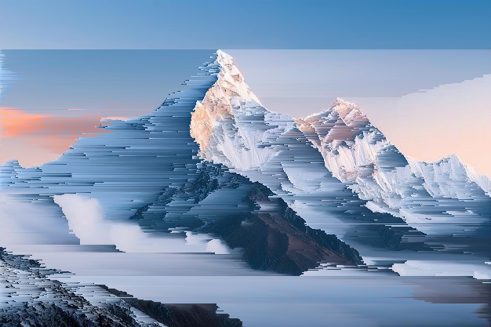
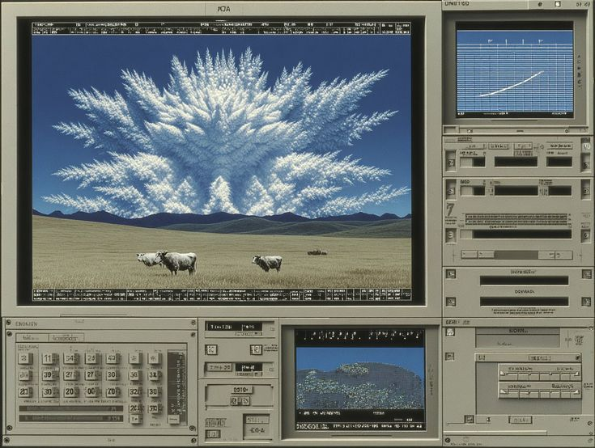
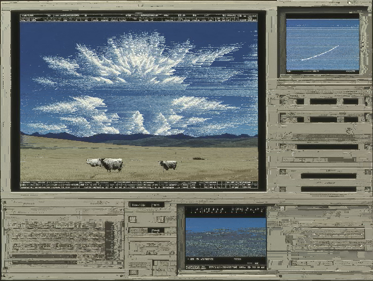
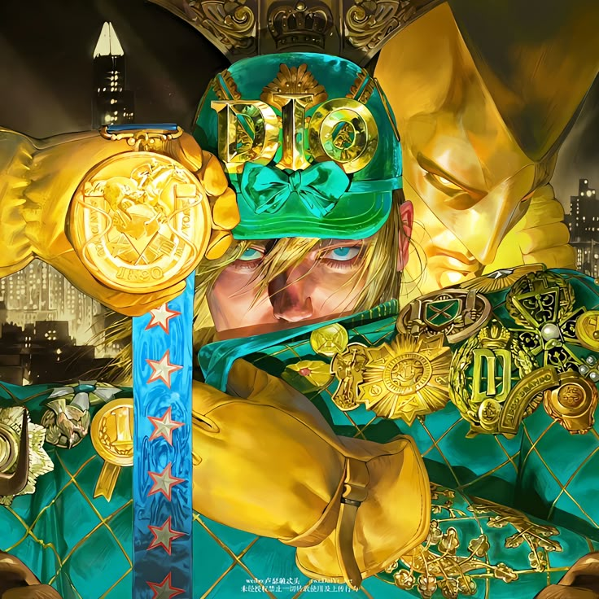
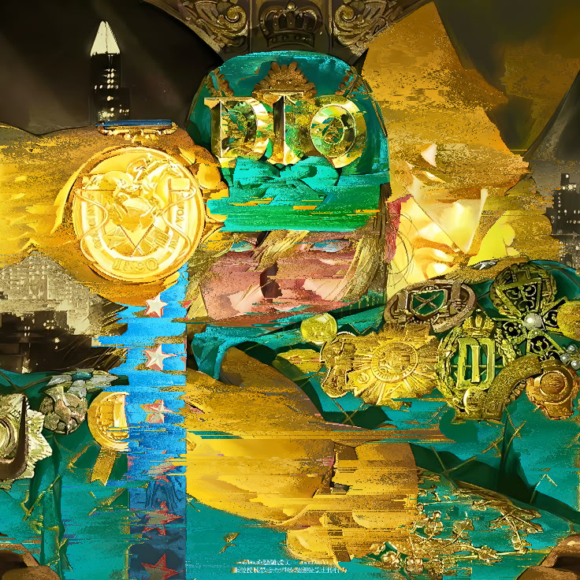

# GPU Pixel Sort

Inspired by <a href="https://www.youtube.com/watch?v=HMmmBDRy-jE&pp=ygUSYWNlcm9sYSBwaXhlbCBzb3J0">this video</a>


## Run
```bash
swift build -c release
./.build/release/pixel-sort input_img.png output_img.png [options]
```

<div align="center">
      
      
</div>

<div align="center">
      
      
</div>

<div align="center">
      
      
</div>
